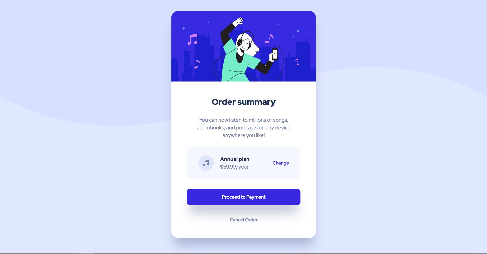

# Componente-de-resumen-de-pedidos
## Tabla de contenido

- #overview
  - #the-challenge
  - #screenshot
  - #links
- #my-process
  - #built-with
  - #what-i-learned
  - #continued-development
- #author
- #acknowledgments

## overview

### the-challenge

Los usuarios deben poder:

- Ver estados de desplazamiento para elementos interactivos

### screenshot

### links

- URL de la solución: https://github.com/Oscar951/Componente-de-resumen-de-pedidos.git
- URL del sitio en vivo: https://componente-de-resumen-de-pedidos.vercel.app/

## my-process

### built-with

- Marcado semántico HTML5
- Propiedades personalizadas de CSS
- Caja flexible
- Flujo de trabajo móvil primero

### Que aprendí

Fue un gran desafio ya que estoy comenzare en el mundo del desarrollo web, pude conocer un poco mas sobre flexbox y tambien me pude apoyar en photoshop para sacra las medidas de los diferentes elementos, aprendi a hacer mas organizado con el codigo.

### Desarrollo continuo

Quiero aprender más sobre flexbox y tambien entender mejor los media queries

## Autor

- Mentor de frontend - [@Oscar951](https://www.frontendmentor.io/profile/Oscar951)
